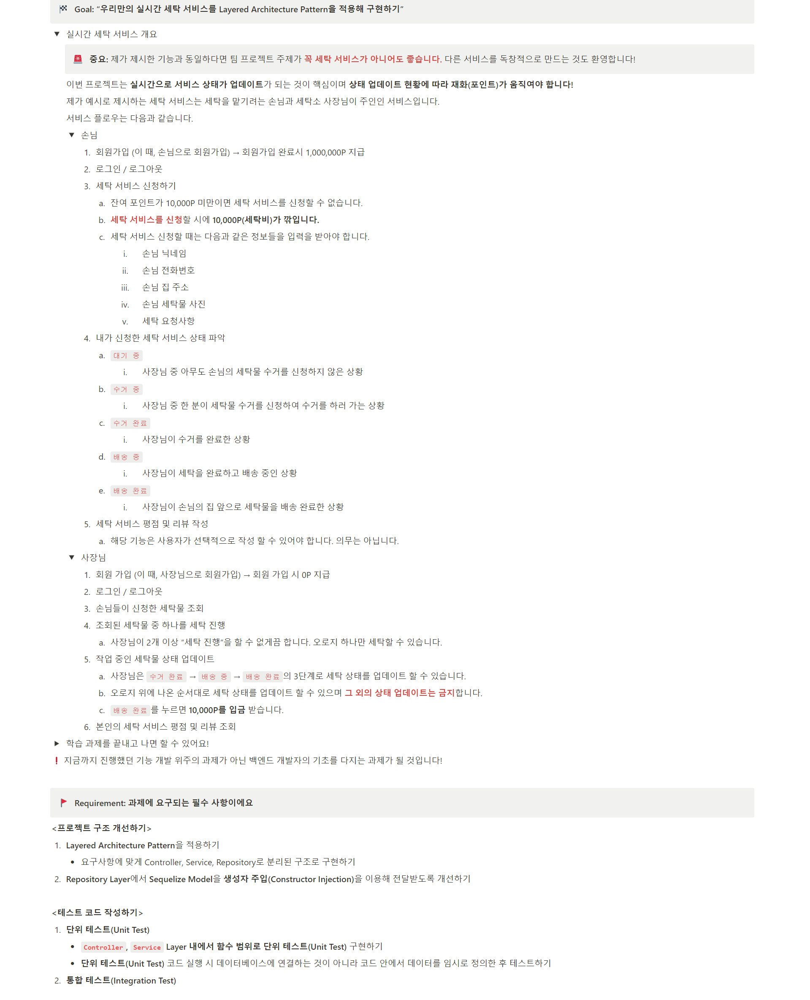
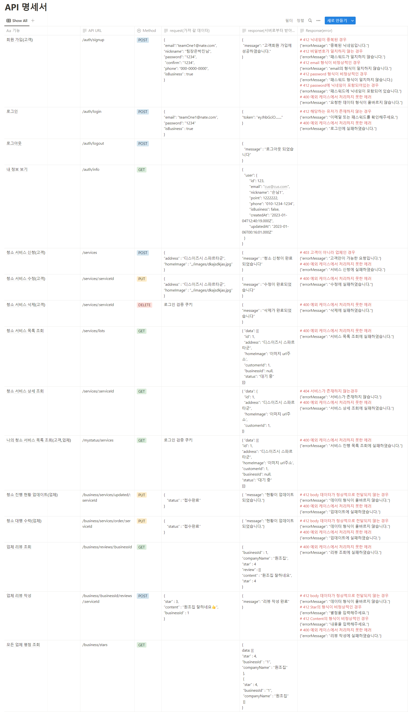

# cleaning-origin
## 실행 전 해야할 일
1. npm install로 의존성 패키지 설치
1. npx sequelize db:create로 db 생성
1. .env.example를 복사하여 .env 파일 생성 후, 안에 필요한 변수 설정.(주로 패스워드 설정 해주면 됨.)

팀프로젝트#3 청소의 원조 - 뉴스피드
=======
|진행기간|22/12/30 ~ 23/01/06|
|-|-|
|서비스목표|청소 대행 고객과 업체 중개 서비스|

# 필수기능 체크리스트
</img>

# 개발환경
|목적|환경|
|-|-|
|서버|Express|
|DB|MySQL|
|라이브러리|bcrypt, cookie-parser, dotenv, ejs, express, jsonwebtoken, multer, mysql2, sequelize, path , fs, socket.io|
|DevJson|jest, nodemon, sequelize-cli, supertest|
|css프레임워크|부트스트랩 , 폰트어썸 등|

# 진행상황
* 22/12/30 - 팀 자기소개 및 S.A 의견 종합, 역할 분담, 프로젝트 시작 파일 셋팅
  * S.A (Starting Assignments) - [링크](https://www.notion.so/SA-6df22dfc02a3413cb15c14df0cd8e69c)   

* 22/12/31 ~ 23/01/01 - 각자 맡은 기능 구현

* 23/01/02
  * Github 활용 - issue, pr 기능 사용 시작
  * 미구현 API 구현
  
* 23/01/03 ~ 23/01/05
  * API 기능 모두 완료 및 병합
  * Front 작업 시작
  * API 버그 픽스
  * Jest를 활용한 test code 작성 시작

* 23/01/06
  * 발표 자료 준비
  * 프로젝트 제출
  
# 피드백 & 반영사항
추가 예정

# API
</img>

# 프로젝트 마무리 후 회고
박진 - [블로그 링크](https://5kiran.tistory.com/38)  
오길환- [블로그 링크](https://5kiran.tistory.com/78)   
김승일 - [블로그 링크](https://5kiran.tistory.com/38)  
정성욱 - [블로그 링크](https://velog.io/@squirrelswj)  
정대신 - [블로그 링크](https://5kiran.tistory.com/38)

# 시연 영상
 
